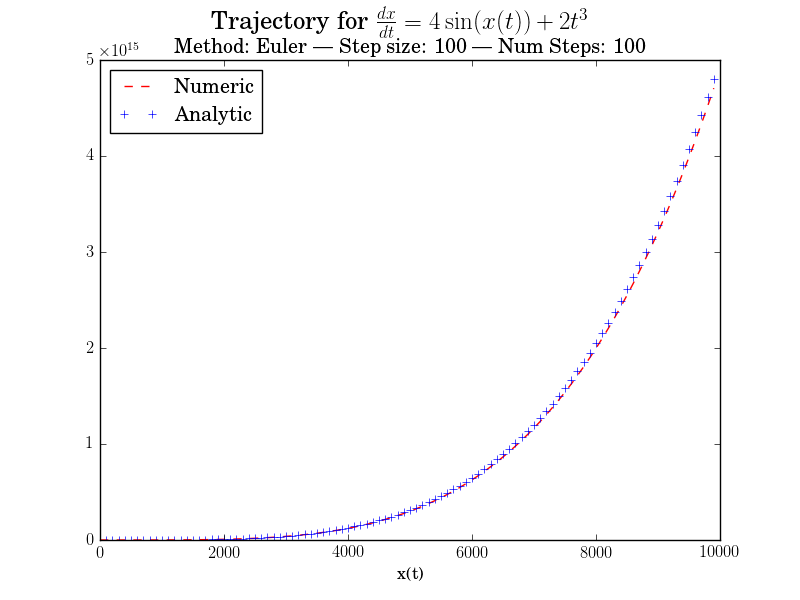
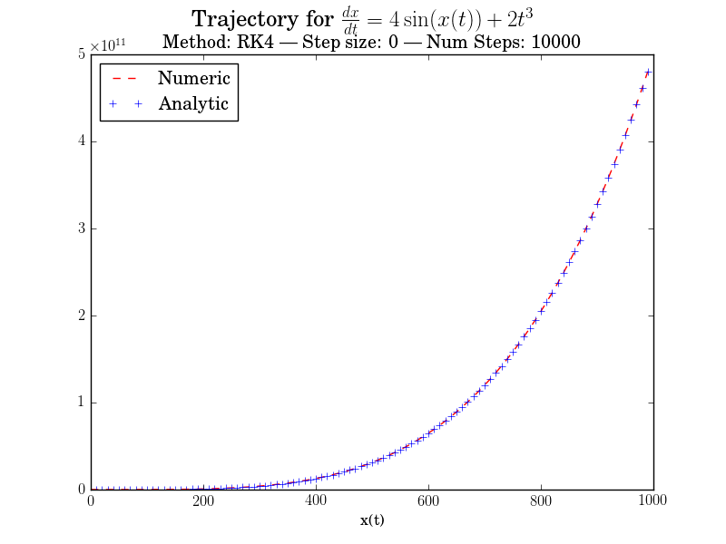
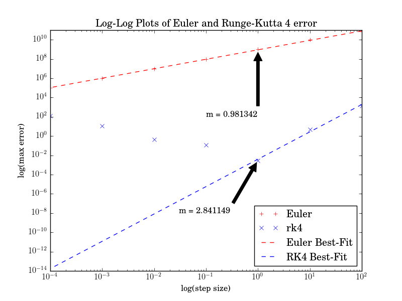
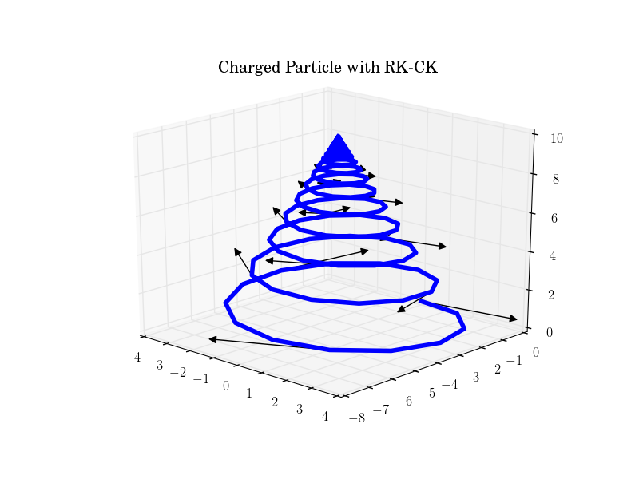
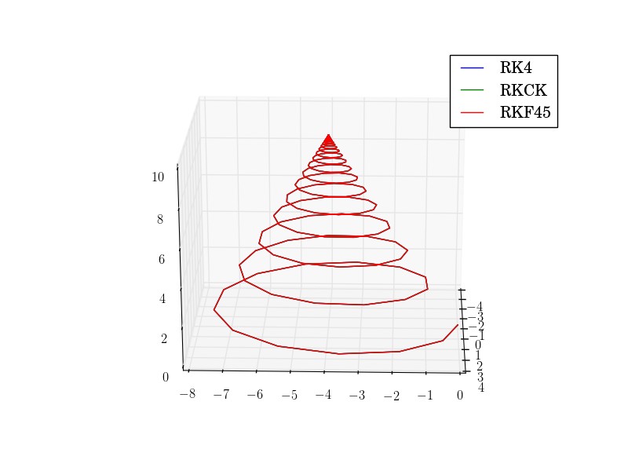

```{r setup, include=FALSE}
knitr::opts_chunk$set(echo = TRUE)
```

## Targets

My canned project was started five minutes before midnight on Wednesday, when it
became apparent that my planned project no longer had any life in it. 
Consequently, there are several pieces missing from this project. In short, there
are two major missing components: tests and timing.

 * Tests:
  I do not have any unit or regression tests for the code, nor do I have coverage
  tests with lcov/gcov. In essence, the `make test` and `make coverage` rules that
  were supposed to be implemented are missing.
  
 * Timing:
  I do not have timers for performance-critical code, or any code, for that matter.
  I am linking GRVY at the moment, but adding timers is another layer of complexity
  that I'm just not ready for. Consequently, there are no timers in the code, and
  thus no performance results, aside from "completes fast enough most of the time."

However, everything else is functioning. I have an input file which takes in
configuration options (documented in the README.md and in comments). I have the
option to run in verification mode for the simple ODE, debug mode for (slightly)
more verbose outputs, three RK methods in GSL, and a homegrown Euler's method.

# Plotting Code

Code to generate these plots can be found in the `plotting` directory. Some pieces (e.g. arrow generation) are commented out, but can be uncommented.
The solution paths for the simple ODE are generated by the functions in `plot2Dsol.py`. The code for analyzing convergence of this ODE is in `plot2Dconv.py`

# Simple ODE

The simple ODE I chose was $\frac{dx}{dt} = m \sin(t) + n t^3 / 2$, with fixed
parameters $m = 4$ and $n = 2$. A plot of the solution path with $h = 100$ 
is presented in Figure 1.

```{r fig1,fig.align="center",out.width="4in",out.height="4in",echo=FALSE,message=FALSE,include=TRUE,fig.cap="Solution Trajectory with Euler's Method, h = 100"}

```

An improved solution with $h=10$ is found in Figure 2.
```{r fig2,fig.align="center",out.width="4in",out.height="4in",echo=FALSE,message=FALSE,include=TRUE,fig.cap="Solution Trajectory with Euler's Method, h = 10. Note that the numerial solution is better than in Figure 1."}

```

An example with $h = 10$ using the RK4 method is in Figure 3.
```{r fig3,fig.align="center",out.width="4in",out.height="4in",echo=FALSE,message=FALSE,include=TRUE,fig.cap="Solution Trajectory with RK4, h = 0.1"}

```

```{r fig4,fig.align="center",out.width="4in",out.height="4in",echo=FALSE,message=FALSE,include=TRUE,fig.cap="Convergence Analysis on Log-Log scale, with slopes shown. The divergence of the RK4 method at smaller $h$ is thought to be due to roundoff error. Hence, the slope is only calculated on the points where the error decreases as expected."}

```

Finally, the convergence analysis is presented in Figure 4. Note that Euler's method converges as it should, linearly with $h$. The Runge-Kutta method has
an interesting time of things, as it initially converges as the step size decreases. However, once $h$ reaches 1, the error starts increasing again. I suspect
this is due to roundoff error. Regressing on the three points where the error decreases shows a third-order trend, which is a bit too low for RK4. Most likely
this is because there are not enough points to get an accurate estimate of the error.

# Charged Particle

All of the charged particle simulations use Runge-Kutta methods, and are qualitatively fairly similar. The convergence analysis was done with the
"correct" solution being an RK-F-45 method with $h = 1e-5$.

Figure 5 shows a solution plotted with RKCK, along with some velocity vectors. As expected, the velocity vectors lie more-or-less tangent to the particle's path.

```{r fig5,fig.align="center",out.width="4in",out.height="4in",echo=FALSE,message=FALSE,include=TRUE,fig.cap="An example solution with RKCK, with velocity vectors plotted. As intuition would suggest, the velocity vectors lie tangent to the particle's path"}

```

Figure 6 shows RK4, RKCK, and RKF45 solutions overlaid on each other with $h = 0.1$. As can be seen from the image, there is no distinguishable difference between
these solution paths at $h = 0.1$. Unfortunately, the next largest tested step, $h = 1$, caused a catastrophic failure of the solver, and the solutions are 
essentially straight lines, which are not very interesting.

```{r fig6,fig.align="center",out.width="4in",out.height="4in",echo=FALSE,message=FALSE,include=TRUE,fig.cap="A comparison of all three Runge-Kutta methods, with $h = 0.1$. Even at this relatively coarse timestep, there is no appreciable difference between the three methods."}

```